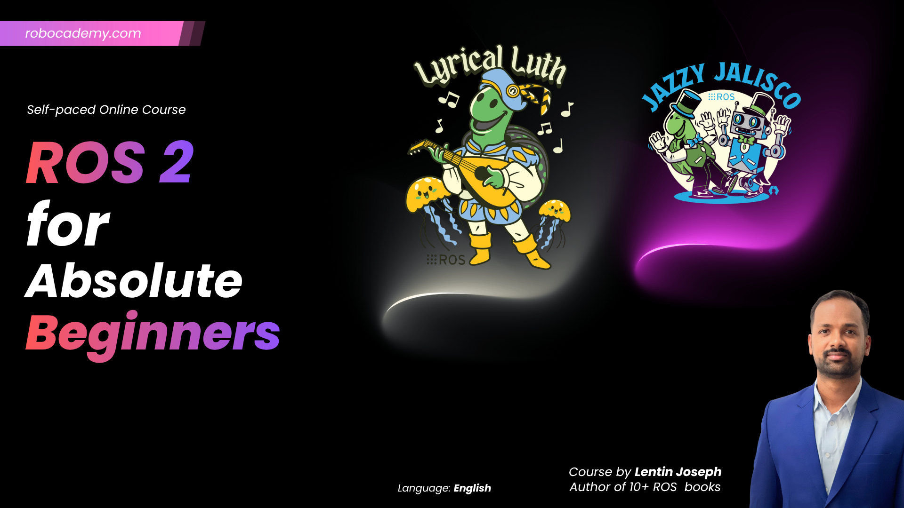

# ROS 2 for Absolute Beginners - Course 2026 (Lyrical & Jazzy)

> Learn ROS 2 from scratch using the latest ROS 2 distributions through hands-on examples, practical exercises, and a mini-project.

<p align="center">
  
</p>


---

## 🚀 Course Overview

Welcome to **ROS 2 for Absolute Beginners - 2026**.

This course is designed for students, software engineers, robotics enthusiasts, researchers, and professionals who want to learn Robot Operating System 2 (ROS 2) from the ground up.

Whether you are completely new to robotics or transitioning from software engineering into robotics, this course provides a structured and practical learning path using the latest ROS 2 distributions and industry best practices.

As a **Senior Robotics Software Engineer**, **Founder of Robocademy**, and **CTO of RUNTIME Robotics**, I have designed this course to bridge the gap between theory and real-world robotics software development. By the end of this course, you will understand the core concepts of ROS 2, develop your own ROS 2 applications using Python and C++, and build a complete mini-project that demonstrates practical robotics software engineering skills.

---

## 🎯 What You Will Learn

After completing this course, you will be able to:

* Understand the architecture and design principles of ROS 2
* Install, configure, and maintain ROS 2 development environments
* Create and manage ROS 2 workspaces
* Create, build, and maintain ROS 2 packages
* Work with Nodes, Topics, Services, Actions, and Parameters
* Use ROS 2 command-line tools effectively
* Visualize and analyze ROS 2 computation graphs
* Develop ROS 2 applications using Python and C++
* Use Turtlesim for hands-on ROS 2 practice
* Debug and troubleshoot ROS 2 applications
* Apply robotics software engineering best practices
* Build a complete ROS 2 mini-project

---

## 📚 Course Curriculum

### Section 1: Introduction to the Course

* Welcome
* Course Overview
* Learning Roadmap
* How to Get the Most Out of This Course
* Course Resources
* Community Support

### Section 2: Introduction to ROS 2

* What is ROS 2?
* Why ROS 2?
* ROS vs ROS 2
* ROS 2 Architecture
* ROS 2 Ecosystem
* DDS Middleware Overview
* ROS 2 Distributions

### Section 3: Installing ROS 2

* Ubuntu Setup
* ROS 2 Lyrical Installation
* ROS 2 Jazzy Installation
* Environment Configuration
* Verification and Testing
* Troubleshooting Common Issues

### Section 4: ROS 2 Concepts

* Nodes
* Topics
* Publishers
* Subscribers
* Services
* Clients
* Actions
* Parameters
* Messages
* Interfaces
* Namespaces
* Remapping
* ROS Graph
* Quality of Service (QoS)

### Section 5: ROS 2 Packages and Workspaces

* Understanding Workspaces
* Creating a Workspace
* Building a Workspace
* Overlay Workspaces
* Understanding Packages
* Creating Python Packages
* Creating C++ Packages
* Managing Dependencies
* Colcon Build System

### Section 6: Practicing ROS 2 Concepts Using Turtlesim

* Introduction to Turtlesim
* Running Turtlesim
* Working with Topics
* Working with Services
* Working with Parameters
* Exploring the ROS Graph
* Practical Exercises
* ROS 2 CLI Practice

### Section 7: Introduction to ROS 2 Client Libraries and Programming

#### Python (rclpy)

* Creating Nodes
* Publishers and Subscribers
* Services and Clients
* Parameters
* Timers
* ROS 2 Application Development

#### C++ (rclcpp)

* Creating Nodes
* Publishers and Subscribers
* Services and Clients
* Parameters
* Timers
* ROS 2 Application Development

### Section 8: Mini Project

Build a complete ROS 2 application by integrating everything learned throughout the course.

Topics include:

* Workspace Setup
* Package Creation
* Node Development
* Inter-Node Communication
* Testing and Debugging
* Final Application

---

## 🛣️ Learning Roadmap

```text
Introduction
    ↓
ROS 2 Installation
    ↓
ROS 2 Concepts
    ↓
Packages & Workspaces
    ↓
Turtlesim Practice
    ↓
ROS 2 Programming
    ↓
Mini Project
    ↓
Advanced ROS 2 Topics
```

---

## 👨‍🏫 Instructor

### Lentin Joseph

Author, Trainer, Robotics Software Architect, Founder of [Robocademy](https://robocademy.com), and CTO of [RUNTIME Robotics](https://runtimerobotics.com).

Lentin Joseph has over **15 years of experience in Robotics and ROS** and is the **author of 11 books on ROS and robotics technologies**. He has trained thousands of students, engineers, researchers, and professionals worldwide in Robotics, ROS, Autonomous Systems, Embedded Systems, and AI.

Throughout his career, he has worked extensively on robotics software architecture, autonomous systems, ROS-based applications, embedded systems, industrial robotics solutions, and robotics product development. Through his work at **Robocademy** and **RUNTIME Robotics**, he continues to contribute to robotics education, software innovation, and the advancement of autonomous systems technologies.

His mission is to make robotics education accessible, practical, and industry-focused.

Connect with Lentin on [LinkedIn](https://www.linkedin.com/in/lentinjoseph).

---

## 🔗 Course Platform

Enroll in the **ROS 2 for Absolute Beginners - 2026 (Lyrical & Jazzy)** course on [Robocademy](https://robocademy.com/courses/ROS-2-for-Absolute-Beginners--2026-Lyrical-Jazzy-6a180c2cae2446e9254c5b60).

To explore more robotics, ROS, AI, autonomous systems, and embedded systems courses, visit [Robocademy](https://robocademy.com).

Learn more about robotics software products and solutions at [RUNTIME Robotics](https://runtimerobotics.com).

---

## 💻 Prerequisites

No prior ROS experience is required.

Recommended:

- Basic computer knowledge
- Basic Linux knowledge (helpful but not mandatory)
- Basic programming knowledge (helpful but not mandatory)

## 🖥️ Supported Platforms

This course can be followed using any modern operating system, including:

- Windows
- Linux
- macOS

To ensure a consistent learning experience across all platforms, the course uses **VirtualBox** with an Ubuntu virtual machine as the primary development environment.

Using VirtualBox allows you to:

- Follow the course regardless of your host operating system
- Avoid modifying your existing operating system
- Use a preconfigured Ubuntu environment for ROS 2 development
- Maintain compatibility with all course exercises and projects

### Development Environment Used in This Course

- VirtualBox
- Ubuntu Linux
- ROS 2 Lyrical
- ROS 2 Jazzy

### Optional Setup

Students who are already using Ubuntu natively may also follow the course directly on their Ubuntu installation.

Docker-based workflows can also be used by students who prefer containerized development environments.

---

## ⚙️ Computer Requirements

| Component      | Recommended                           |
| -------------- | ------------------------------------- |
| Processor      | Intel Core i5 / AMD Ryzen 5 or better |
| RAM            | 8 GB Minimum                          |
| RAM (VM Users) | 16 GB Recommended                     |
| Storage        | 40 GB Free Space                      |
| GPU            | Optional                              |
| Internet       | Required                              |

---

## 📦 Software Used

Throughout this course, we will use:

* Ubuntu Linux
* ROS 2 Lyrical
* ROS 2 Jazzy
* Python 3
* C++
* Docker
* VirtualBox
* Colcon
* Git
* VS Code (Optional)

---

## 🎓 Who This Course Is For

This course is suitable for:

* Absolute Beginners in ROS 2
* Robotics Students
* Software Engineers
* Embedded Systems Developers
* Mechatronics Engineers
* Researchers
* Robotics Hobbyists
* Professionals Transitioning into Robotics
* Robotics Software Engineers seeking ROS 2 fundamentals

---

## 🌟 Why Learn ROS 2?

ROS 2 is the industry-standard robotics middleware used in:

* Autonomous Mobile Robots (AMRs)
* Industrial Robots
* Service Robots
* Autonomous Vehicles
* Drones and UAVs
* Research Labs
* Space Robotics

Learning ROS 2 opens opportunities in:

* Robotics Software Engineering
* Autonomous Systems Development
* AI-Powered Robotics
* Industrial Automation
* Research and Development
* Robotics Product Development

---

## 📂 Resources Included

* Lecture Videos
* Source Code
* Example Projects
* Practice Exercises
* Mini Project
* Course Slides
* Downloadable Resources

---

## 🛠️ Skills You Will Gain

* ROS 2 Fundamentals
* Robotics Software Development
* Linux-Based Development
* ROS 2 Communication Patterns
* Python Programming
* C++ Programming
* Package Development
* Workspace Management
* Debugging and Troubleshooting
* Robotics Application Development
* Software Engineering Best Practices for Robotics

---

## 📢 Support

If you have questions during the course:

* Use the course discussion section
* Search existing discussions first
* Include screenshots and logs when asking questions
* Be as descriptive as possible

---

## 🚀 What's Next After This Course?

After completing this course, you will be ready to learn:

* Gazebo Simulation
* RViz Visualization
* TF2
* Robot Localization
* SLAM
* Navigation2 (Nav2)
* Robot Manipulation
* Autonomous Navigation
* Real Robot Integration
* Advanced ROS 2 Development

---

## 🎯 Course Goal

The goal of this course is to provide a strong foundation in ROS 2 and robotics software engineering so that students can confidently move on to advanced robotics topics, autonomous systems development, and real-world robotics projects.

---

# 🤖 Let's Start Building Robots with ROS 2!

Happy Learning!

**Lentin Joseph**
Senior Robotics Software Engineer, Founder of [Robocademy](https://robocademy.com), and CTO of [RUNTIME Robotics](https://runtimerobotics.com)
